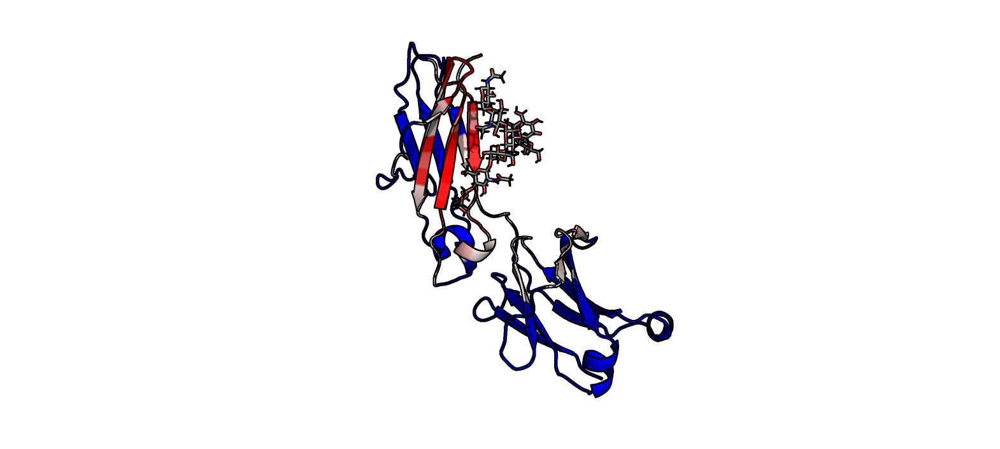
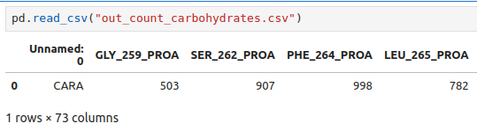

# Glyco-MKII
Contains code for the script Glyco-MKII. Used to compute from trajectory and topology file, the frequence of residues interacting with carbohydrates.
It produce a csv file with the residue interacting, and the number of frames while they are interacting with the carbohydrates.
But also a PDB file for which underline the residues interacting with the carbohydrates. With the b-factor corresponding to the frequency.

## Settings.

### Environment.
The wide user will create a conda environment in order to safely use this script.

Using the `Glyco-MKII.yml` and the following command line, the user can easily create this environment :

`<conda/micromamba> create -n Glyco-MKII -f Glyco-MKII.yml`

And then :

`<conda/micromamba> activate Glyco-MKII`

## Usage.
Once the environment is activated, here the command line to use **Glyco-MKII** :

`./Glyco_MKII.py -top <topology_file> -trj <trajectory_file> -output <output_path> -threshold <threshold_interaction>`
    
### Arguments.
  - **top** : Indicate the path to the topology file (PDB,GRO,CIF...).

  - **trj** : Indicate the path to the trajectory file (XTC,DCD,TRR...).

  - **output** : Indicate the path to the output files. The output files are a csv named **out_count_carbohydrates.csv**, and as much PDB files as number of carbohydrates named **contact_with_<segid_of_carbohydrate>.pdb**

  - **threshold** : Indicate the threshold to count a distance as a contact between a heavy atoms of the carbohydrates and the residues.

**COOL TRICKS ABOUT TRAJECTORY AND TOPOLOGY FILES** :

  - About the *topology*: To make the computation faster, it is possible to use the topology file with only the protein and carbohydrates. Without the solvant.
    
  - About the *trajectory* : If the topology have no solvant, be sure that you also removed it in the trajectory file (with `gmx trjconv` for example). Also, if the use have replicas, you concatenate the trajectory files.

## Outputs.

The script produce a *csv* file with the how many frame the residue is in contact with the carbohydrate.

And it produced PDB file of the input protein, but with the b-factor replaced by the percentage of time that a residue was a contact with the carbohydrate.
One PDB file is produce by carbohydrate.

## Color with Pymol

Once loaded, to show color the protein depending on the frequency of interaction, the following command line can be use in PyMol:

`spectrum b, blue_white_red, selection=polymer`

## Example.

You can try the using the files in the **examples** folder as follow :

`./Glyco_MKII.py -top examples/topology_file.pdb -trj examples/trajectory_file.xtc -output . -threshold 8`

And will produce these outputs :
    - **contact_with_CARA.pdb** : The PDB file with the proportion of interaction as b-factor.
    - **out_count_carbohydrates.csv** : The CSV file which contains the informations of how many time a residue is in contact with the carbohydrate.

These outputs are also in the `examples/results/`.

The PDB file colored by PyMol. It was colored, using the command line shown earlier.
Blue demonstrate a no interactions at all, and going through white to red, demonstrate greater count of contact.
The grey molecule here is the carbohydrate.

And the CSV file.

